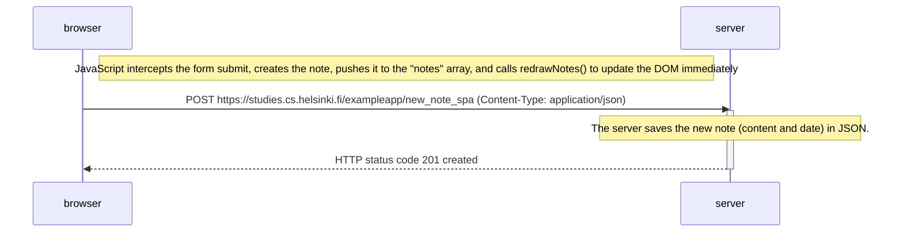

```mermaid
sequenceDiagram
    participant browser
    participant server

    Note right of browser: JavaScript intercepts the form submit, creates the note, pushes it to the "notes" array, and calls redrawNotes() to update the DOM immediately

    browser->>server: POST https://studies.cs.helsinki.fi/exampleapp/new_note_spa (Content-Type: application/json)
    activate server
    Note over server: The server saves the new note (content and date) in JSON.
    server-->>browser: HTTP status code 201 created
    deactivate server

```
